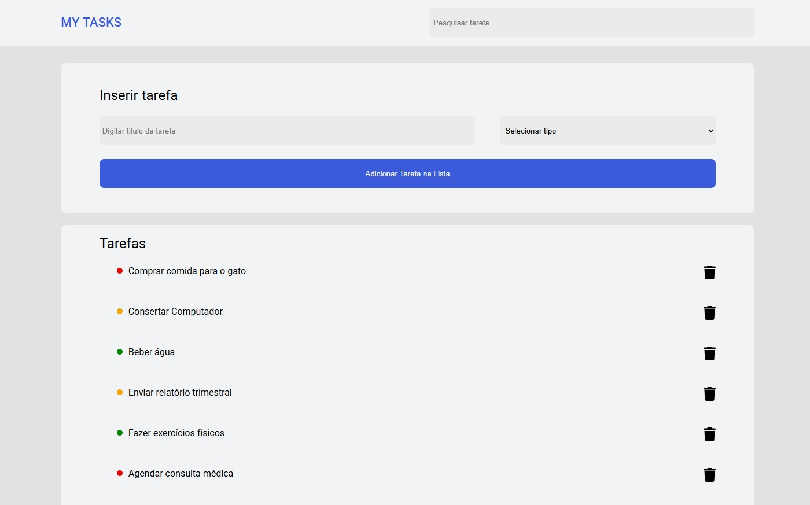

# 📝 Projeto: Lista de Tarefas

Projeto desenvolvido como parte do aprendizado na **Kenzie Academy Brasil**.  
A aplicação é uma lista de tarefas interativa que permite adicionar, concluir e remover tarefas de forma simples e eficiente.

---

## 📋 Funcionalidades

- ✅ Adicionar novas tarefas;
- 🗂️ Marcar tarefas como concluídas;
- 🗑️ Remover tarefas da lista.

---

## 🖼️ Capturas de Tela



## 🚀 Tecnologias Utilizadas

- 🌐 HTML5
- 🎨 CSS3
- ⚙️ JavaScript (ES6)

---

## 💻 Como executar o projeto

1. Clone este repositório:
   ```bash
   git clone https://github.com/dkrausz/lista_de_tarefas.git
   ```
2. Abra a pasta do projeto:

   ```bash
    cd lista_de_tarefas
   ```

3. Abra o arquivo index.html no navegador:

- Pode dar duplo clique no arquivo, ou

- Usar uma extensão como Live Server no VS Code.

---

## 🔗 Acesso ao Projeto

- Repositório GitHub: [https://github.com/dkrausz/lista_de_tarefas](https://github.com/dkrausz/lista_de_tarefas)
- GitHub Pages: [https://dkrausz.github.io/lista_de_tarefas/](https://dkrausz.github.io/lista_de_tarefas/)

---

## 📝 Licença

Este projeto é de uso educacional e não possui uma licença específica.
